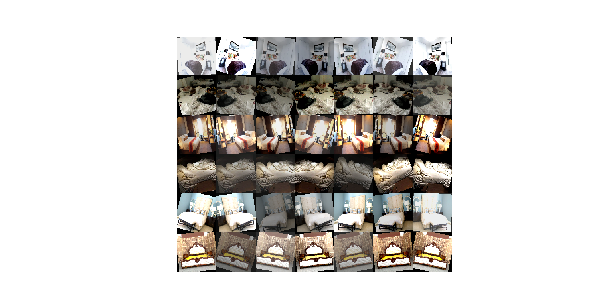

# MakeYourBed

A binary image classifier that tells you whether your bed is made or not. Probably not the next big app but was interesting to make!

## Data collection
Since I couldn't find any dataset for this project (unsurprisingly) I used a combination of Google images and Flickr API to build a dataset. 

 ### Google images

Downloaded through the python package [google-images-download](https://github.com/hardikvasa/google-images-download) in getGoogleImages.py. Requires [chromedriver](https://chromedriver.chromium.org/) to scrape any large number of images. 

The following keywords were used : 

* Made bed: "bedroom bed", "made bed", "perfect bed", "simple hotel bed"
* Unmade bed: "bedroom bed messy", "crumpled bed messy", "crumpled duvet bed", "messy bed"

Each yielding ~  400 images.

### Flickr

Requires a Flickr api key but it's very easy to get, done in flickr_main.py. Flickr api allows for easy download of 1000+ images given a keyword and is a good source of images for such projects. This [article](https://medium.com/@adrianmrit/creating-simple-image-datasets-with-flickr-api-2f19c164d82f) explains the process.

The following keywords were used : 

* "made bed"
* "messy bed"
* "unmade bed"

The images were then manually checked, deleting irrelevant or unsuitable images. A lot of images were deleted where the bed was not the focus of the image. The Flickr images had a lot of irrelevant images but that is also probably due to the large number of images taken for a given keyword (1000+ vs 400 for google). After going through the images I was left with ~1500 images of each class which should be enough for a half descent result. The full dataset is too large for GitHub but will be provided if someone is interested.

## Model

Due to the limited computational resources at my disposal, I chose to use transfer learning with a model pre-trained on imagenet rather than training it from scratch. Specifically, resnet-101 as provided by the convenient PyTorch based package [cnn-finetune](https://pypi.org/project/cnn-finetune/). Only the classifier (fully connected layers) was changed in order to be appropriate for binary classification. The images were resized to be 224x224 before being inputted but a smaller image size may have been sufficient.

## Training

Without using any image augmentation the model quickly fits to the train data, approaching 100% accuracy within 22 epochs but the test accuracy does not increase past 12 epochs (88% test accuracy) so training past that point seems to start overfitting to the train data.

In order to avoid overfitting and possibly increase generalization, I tried to use image augmentation, specifically random slight rotations, horizontal flips and [ColorJitter](https://pytorch.org/docs/stable/torchvision/transforms.html#torchvision.transforms.ColorJitter). I ran training for a significantly longer time and the model did take a while to deal with all the variability in the train set but eventually reached a similar test performance to the previous model so the augmentation does not seem to have helped much. It is likely that the model can not do better than 88% due to the low quality of the dataset and test set despite manual filtering.

## Performance

As seen from the confusion matrix below the errors seem to be spread fairly evenly between false negatives and positives but through manual inspection, this was mostly due to odd pictures in the test set. Further testing the model on handpicked images showed that while working well in most standard cases the model tends to fail when presented with beds that are unmade but are not messy, so no crumpled duvets, etc. This is likely because the images labeled unmade in the dataset are overwhelming with crumpled sheets etc. and not just with a folded duvet. Unusual, bold patterns on duvets of made beds also sometimes triggered false negatives, likely due to being mistaken for creases.

|               | Unmade | Made |
|---------------|--------|------|
| Actual Unmade | 138    | 16   |
| Actual Made   | 20     | 133  |

Example of misclassified pictures:

## Possible further improvements

In order to deal with the main sources of error, the data should be supplemented with more "in-between" cases. The problem would also be made much easier by standardizing the angle of the picture to some extent, so no pictures from the side, etc although getting such data would be significantly harder.

## Try it yourself
After cloning the repo and installing the dependencies from the requirements.txt, download the [model](https://drive.google.com/file/d/1VrKaAKTFN1yO4CJKpgO6SPO2aZn_xBEB/view?usp=sharing) and place it in the finalModel directory in the root. Then run classifyPic.py and supply it with an image url. You can also train from scratch by running train.py